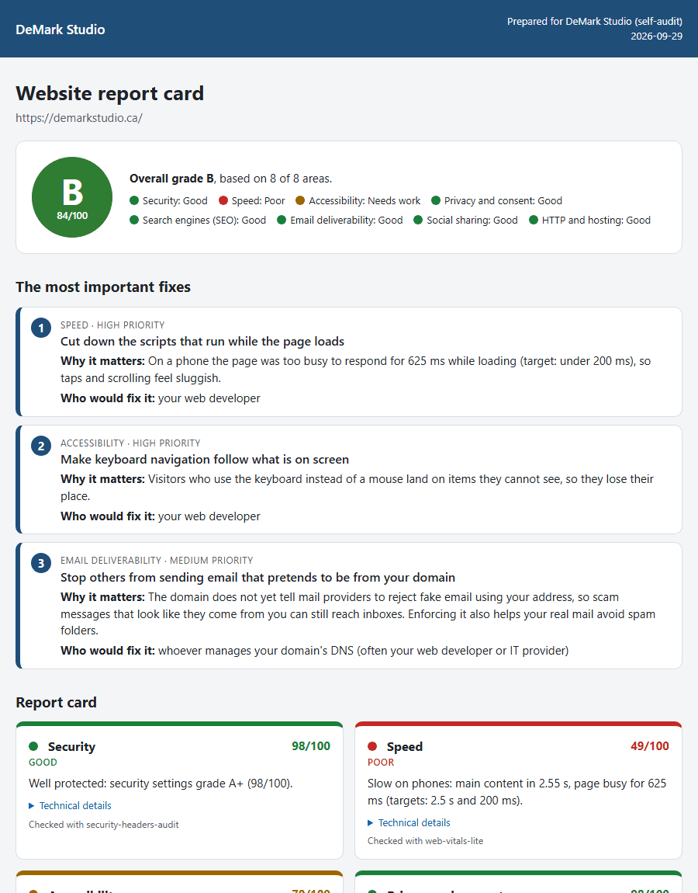

# website-report-card

One **client-friendly website report card** built from eight small website checks: a letter grade, a green/amber/red light per area, and the **three fixes that matter most**, written for a business owner (what to do, why it matters, who would do it). HTML, Markdown, JSON and an optional PDF, with your agency's name, logo and colour.



It runs these tools as subprocesses, one after another, and reads their JSON:

| Area | Tool | What runs |
|---|---|---|
| Security | [security-headers-audit](https://github.com/dreadmoreeee/security-headers-audit) | headers, HTTPS redirect, TLS, cookies |
| Speed | [web-vitals-lite](https://github.com/dreadmoreeee/web-vitals-lite) | 1 page load, throttled mobile profile |
| Accessibility | [a11y-audit](https://github.com/dreadmoreeee/a11y-audit) | axe-core plus keyboard, 200% text and reduced-motion checks, 1 page |
| Privacy and consent | [consent-tracker-scan](https://github.com/dreadmoreeee/consent-tracker-scan) | what loads before consent, 1 page, nothing clicked |
| Search engines (SEO) | [site-seo-crawler](https://github.com/dreadmoreeee/site-seo-crawler) | crawl of at most 10 URLs |
| Social sharing | [og-card-check](https://github.com/dreadmoreeee/og-card-check) | Open Graph and X card tags and images |
| Email deliverability | [email-dns-check](https://github.com/dreadmoreeee/email-dns-check) | MX, SPF, DKIM, DMARC for the domain (DNS only) |
| HTTP and hosting | [http-protocol-check](https://github.com/dreadmoreeee/http-protocol-check) | HTTP/2, HTTP/3, TLS versions, certificate, compression |

- **Works with what it has.** A missing tool, a crash, a timeout or output that is not valid JSON turns that card into "Not checked" with a short reason, and the area is left out of the grade (the report says so).
- **Keeps the evidence.** Each tool's raw JSON is saved, and `--from-dir` rebuilds the report from those files without touching the site again.
- **Self-contained HTML.** Inline CSS, no fonts, scripts or images from elsewhere. Technical details sit in collapsible sections that open by themselves when printed, and cards are not split across pages where they fit on one.
- **No dependencies** of its own (standard library, Python 3.10+). Playwright is only needed for `--pdf`; the tools have their own requirements.

## Install

```
pip install .
```

Put the tool folders next to this checkout (or in the folder above it), or install them so their commands are on `PATH`. For `--pdf`: `pip install playwright` and `python -m playwright install chromium`.

## Usage

```
website-report-card https://example.com --brand-name "Maple Web Co." --brand-logo logo.png \
    --brand-color "#1f4e79" --prepared-for "Riverbend Bakery" --pdf
python -m website_report_card --from-dir report-card/raw --out-dir rerender
```

| Option | Default | Meaning |
|---|---|---|
| `-o, --out-dir DIR` | `report-card` | where `report.html`, `.md`, `.json` (and `.pdf`) go |
| `--name NAME` | `report` | base file name |
| `--format LIST` | `html,md,json` | which files to write |
| `--pdf` | off | also write a Letter-size PDF with Chromium |
| `--raw-dir DIR` | `OUT_DIR/raw` | each tool's JSON plus `run.json` (exit codes, times, reasons) |
| `--from-dir DIR` | | build from saved raw files; no tool is run |
| `--local-src DIR` | see below | folder that holds the tool source folders |
| `--skip TOOL` | | do not run a tool (repeatable) |
| `--timeout S` | per tool, 90 to 300 | timeout for every tool |
| `--brand-name`, `--brand-color` | | agency name; `#rgb` or `#rrggbb`, anything else is refused |
| `--brand-logo FILE_OR_URL` | | a file is inlined as a `data:` URI; a URL is loaded when the report is opened |
| `--prepared-for`, `--date` | today | client name and report date |
| `--fail-under GRADE` | | exit 1 if the grade is below A, B, C, D or F |

Exit codes: `0` report written, `1` grade below `--fail-under`, `2` usage error, `3` PDF could not be written (the other files were). [examples/monthly-report.yml](examples/monthly-report.yml) is a scheduled CI job that keeps the report as a build artifact.

## How it works

**Finding the tools.** For each tool it looks for `<folder>/<package>/__main__.py` in `--local-src`, or by default next to this checkout and then in the folder above it, and runs `python -m <package>` with that folder as working directory and on `PYTHONPATH` (the same idea as `--local-src` in [website-ci-checks](https://github.com/dreadmoreeee/website-ci-checks)). Otherwise it uses the installed command of the same name. `PYTHONUTF8=1` is set for every tool.

**Politeness.** Tools run one at a time and keep their own delays (1 s between requests). Only GET/HEAD requests and TLS handshakes; nothing is clicked, submitted or logged into. The tools that accept a User-Agent get `website-report-card/1.0 (+https://github.com/dreadmoreeee/website-report-card)`; web-vitals-lite keeps its phone User-Agent (which already carries its own product token) so the site serves what a phone gets.

**Scores per area (0 to 100)** and lights: green from 80, amber from 50, red below.

| Area | Score |
|---|---|
| Security | the tool's own score |
| Speed | LCP 40%, TBT 30%, CLS 30%; each metric 100 up to "good", 50 at "poor", 0 at twice "poor". Capped at 79 if a metric needs improvement and at 49 if one is poor |
| Accessibility | 100 minus 25 per critical, 15 per serious, 7 per moderate, 3 per minor rule |
| Privacy and consent | 100 minus 30 per high, 10 per medium, 2 per low finding |
| SEO | the crawler's average page score |
| Social sharing | 100 minus 25 per error, 8 per warning |
| Email deliverability | 100 minus 30 per failed, 10 per warning check (MX, SPF, DMARC, DKIM...) |
| HTTP and hosting | 100 minus 30 per error, 10 per warning |

**Overall grade.** Weighted average of the areas that were checked: Security 20, Speed 15, Accessibility 15, Privacy 15, SEO 15, Email 10, Social 5, HTTP 5. Areas not checked are dropped and the other weights scaled up. A from 90, B from 80, C from 70, D from 60, F below.

**Top 3 fixes.** Every problem the tools report is mapped to a plain-language fix with a severity (high, medium, low). The same problem seen by two tools (HSTS, certificate, HTTPS redirect) counts once. Fixes are ranked by severity, then by the area's weight, taking one per area first. Cosmetic SEO warnings (title or description length) are low priority.

## Measured result

Real run against my own site on 2026-09-29 at 12:07 UTC, all eight tools from their source folders. It took 56 seconds and exited `0`; no tool failed. The site got about 15 page loads (1 speed, 1 accessibility, 1 consent, 10 crawled URLs, 1 social, 1 security), plus header-only requests, image checks, TLS handshakes and DNS lookups.

```
python -m website_report_card https://demarkstudio.ca --out-dir examples --name demarkstudio-report --raw-dir examples/raw --pdf --brand-name "DeMark Studio" --prepared-for "DeMark Studio (self-audit)"
```

I then adjusted some wording and priorities and re-rendered from the saved raw JSON (`--from-dir examples/raw`), so the site was not loaded a second time. Output of that re-render, unedited (the times are from the live run):

```
Website report card: https://demarkstudio.ca/
Overall grade: B (84/100), 8 of 8 areas checked

  GREEN  Security               98  Well protected: security settings grade A+ (98/100).
  RED    Speed                  49  Slow on phones: main content in 2.55 s, page busy for 625 ms (targets: 2.5 s and 200 ms).
  AMBER  Accessibility          70  2 problem(s) that make the site harder to use for some visitors (2 serious).
  GREEN  Privacy and consent    98  No tracking before consent; only low-risk services load (no consent banner).
  GREEN  Search engines (SEO)   99  In good shape for search engines: 7 page(s) checked, average 98.6/100.
  GREEN  Email deliverability   90  Email authentication is set up, with gaps in DMARC.
  GREEN  Social sharing         84  Shared links show a preview card, with small issues.
  GREEN  HTTP and hosting       80  HTTP/2, HTTP/3 advertised; 2 outdated or missing setting(s) to update.

Top 3 fixes:
 1. [Speed] Cut down the scripts that run while the page loads (high)
    Why: On a phone the page was too busy to respond for 625 ms while loading (target: under 200 ms), so taps and scrolling feel sluggish.
    Who: your web developer
 2. [Accessibility] Make keyboard navigation follow what is on screen (high)
    Why: Visitors who use the keyboard instead of a mouse land on items they cannot see, so they lose their place.
    Who: your web developer
 3. [Email deliverability] Stop others from sending email that pretends to be from your domain (medium)
    Why: The domain does not yet tell mail providers to reject fake email using your address, so scam messages that look like they come from you can still reach inboxes. Enforcing it also helps your real mail avoid spam folders.
    Who: whoever manages your domain's DNS (often your web developer or IT provider)

Tools:
  security-headers-audit  exit 0     3.3 s  ok
  web-vitals-lite         exit 0     8.5 s  ok
  a11y-audit              exit 0    13.7 s  ok
  consent-tracker-scan    exit 0     4.9 s  ok
  site-seo-crawler        exit 0    12.4 s  ok
  og-card-check           exit 0     3.4 s  ok
  email-dns-check         exit 0     0.9 s  ok
  http-protocol-check     exit 0     6.9 s  ok
Wrote examples\demarkstudio-report.html
Wrote examples\demarkstudio-report.md
Wrote examples\demarkstudio-report.json
Wrote examples\demarkstudio-report.pdf
```

Files: [HTML](examples/demarkstudio-report.html), [Markdown](examples/demarkstudio-report.md), [JSON](examples/demarkstudio-report.json), [PDF](examples/demarkstudio-report.pdf), raw tool output in [examples/raw/](examples/raw/).

Honest reading:

- **Speed is red on a single mobile load**: TBT 625 ms (poor) and LCP 2.55 s (just over 2.5 s) with 4x CPU slowdown and a slow network. One run is noisy; web-vitals-lite's own 3-run median earlier the same day was LCP 2.66 s and TBT 471 ms, which also misses both targets. Desktop was not measured here.
- **Accessibility**: the two serious findings are real: keyboard focus lands on carousel slides that are off screen, and at 200% text the main navigation no longer fits.
- **Email**: DMARC is still `p=none` (monitoring only). **Hosting**: TLS 1.0 and 1.1 are still accepted at the CDN.
- **SEO** stopped at the 10-URL limit (7 HTML pages scored, 2 titles over 60 characters). **Privacy**: the only third party is cookieless Cloudflare Web Analytics, so there is no banner and nothing to consent to.

"Not checked" cards are covered by the tests (missing tool, crash, timeout, invalid JSON, unreachable site) rather than by this run, since every tool worked.

```
$ python -m pytest -q -p no:cacheprovider --import-mode=importlib website-report-card
...............................................................          [100%]
63 passed in 5.32s
```

The tests need no internet: a fake `subprocess.run` answers with canned JSON (invented example.com data), and one test runs real subprocesses against fake tool folders, one that sleeps past the timeout, one that crashes and one that is missing. The PDF test is skipped if Chromium is not installed.

## Limitations

- It inherits every tool's limits: one page for speed, accessibility and consent (the start URL), at most 10 crawled URLs, lab speed data from one machine, and automated accessibility checks that find only part of all problems.
- The plain-language texts cover the common findings; anything else gets a generic line with the tool's own message in the technical details.
- The weights and cut-offs are a judgement call, documented above and in every report. The grade compares a site with itself over time better than with other sites.
- Privacy notes are general information, not legal advice.
- A `--brand-logo` URL makes the HTML load that image when opened; use a file to keep the report fully self-contained.

## Author

Marvin Palencia, founder of [DeMark Studio](https://demarkstudio.ca), Miramichi, New Brunswick, Canada. Portfolio: [marvin.demarkstudio.ca](https://marvin.demarkstudio.ca)

MIT License.
